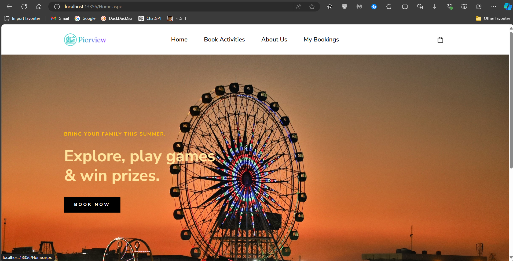
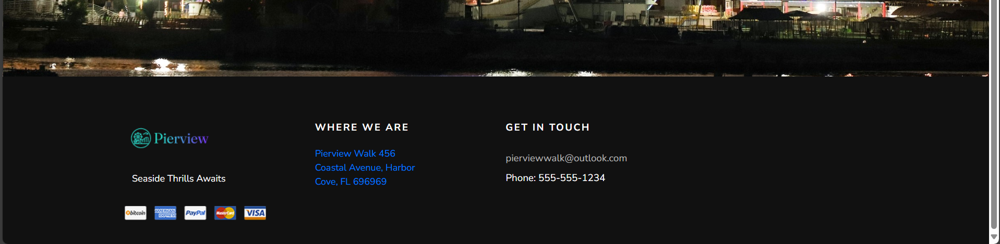
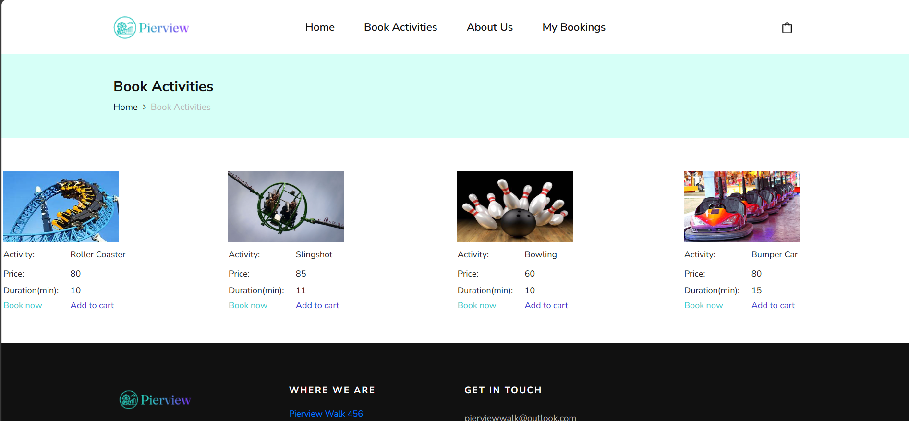
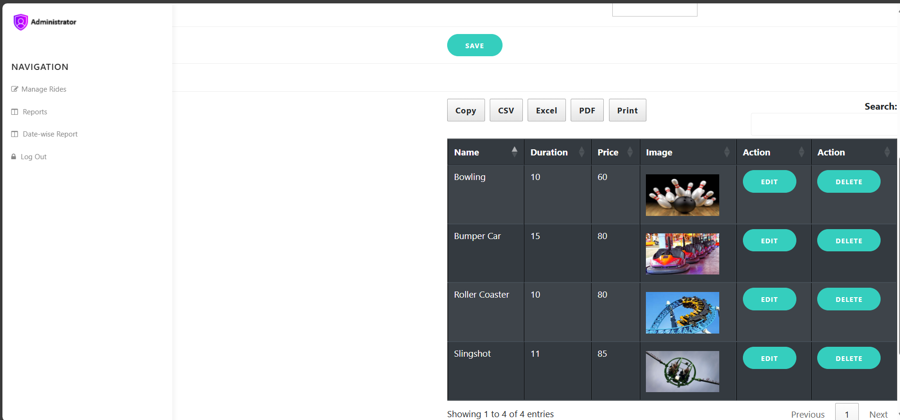

# Amusement Park Carnival Management Booking Platform

This web development project was created by me for a college assignment. This was my first project, and it provides functionality for both clients and administrators to manage bookings and activities at an amusement park carnival.

## Features

### Client Side
1. **Book Rides/Activities**: Users can book rides and activities through an easy-to-use interface.
2. **View & Manage Bookings**: Users can view and manage their bookings, making changes or cancellations as needed.

### Admin Side
1. **Manage Rides/Activities**: Administrators can add, remove, and update the status of rides and activities.
2. **View Reports**: Administrators can view reports on bookings and activities to monitor and manage the park efficiently.

## Technologies Used

- **Backend**: C#
- **Frontend**: HTML, CSS, JavaScript
- **Database**: Microsoft SQL Server
- **Development Environment**: Visual Studio .NET

## Warning
    You can use this as a reference for your project/s.

    This was my first web development project and there's a chance for errors popping up. However, there's nothing that can't be fixed. 

## Screenshots

